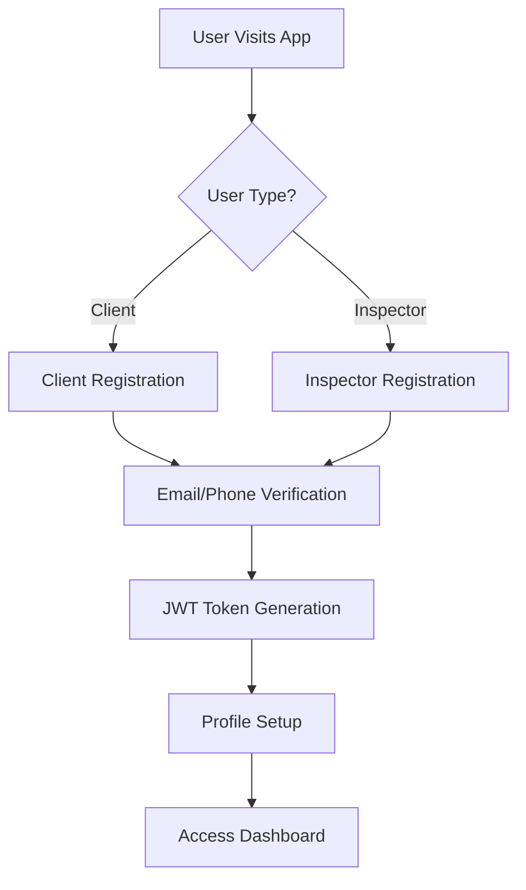
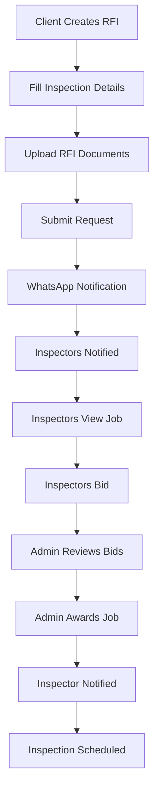
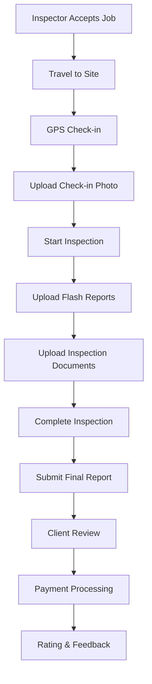
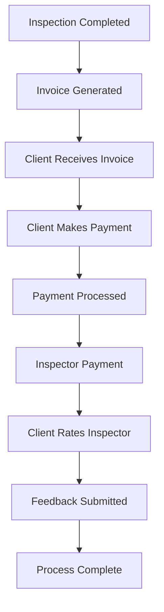

# System Architecture and Complete Flow Documentation

## System Overview

This is a comprehensive Laravel-based ERP system designed for inspection services management. The system connects clients who need inspection services with qualified inspectors, managing the complete workflow from request to completion.

## Architecture Diagram

```
┌─────────────────┐    ┌─────────────────┐    ┌─────────────────┐
│   Web Frontend  │    │  Mobile Apps    │    │   Admin Panel   │
│   (React PWA)   │    │  (Expo/React)   │    │   (Laravel)     │
└─────────────────┘    └─────────────────┘    └─────────────────┘
         │                       │                       │
         └───────────────────────┼───────────────────────┘
                                 │
                    ┌─────────────────┐
                    │   API Gateway   │
                    │   (Laravel)     │
                    └─────────────────┘
                                 │
                    ┌─────────────────┐
                    │  Business Logic │
                    │   (Controllers) │
                    └─────────────────┘
                                 │
         ┌───────────────────────┼───────────────────────┐
         │                       │                       │
┌─────────────────┐    ┌─────────────────┐    ┌─────────────────┐
│   Database      │    │  File Storage   │    │  External APIs  │
│   (MySQL)       │    │   (Local/S3)    │    │ (Stripe/WhatsApp)│
└─────────────────┘    └─────────────────┘    └─────────────────┘
```

## Core Components

### 1. User Management System
- **Multi-role Architecture**: Admin, Client, Inspector
- **JWT Authentication**: Secure token-based authentication
- **Role-based Access Control**: Different permissions for each role
- **Profile Management**: Complete user profile with country, company details

### 2. Enquiry Management System
- **Request for Inspection (RFI)**: Clients create inspection requests
- **Geographic Filtering**: Inspectors see jobs in their country
- **Status Tracking**: Complete lifecycle management
- **File Attachments**: RFI documents and specifications

### 3. Bidding System
- **Inspector Bidding**: Inspectors bid on available jobs
- **Bid Management**: Amount, availability, currency support
- **Award Process**: Admin selects winning bids
- **Status Tracking**: Pending, Accepted, Rejected, Completed

### 4. Inspection Workflow
- **Check-in System**: GPS-based location verification
- **Report Upload**: Flash reports and inspection documents
- **Real-time Updates**: WhatsApp notifications
- **Progress Tracking**: Complete inspection lifecycle

### 5. Payment System
- **Stripe Integration**: Secure payment processing
- **Invoice Management**: Automated invoice generation
- **Transaction Tracking**: Complete payment history
- **Multi-currency Support**: Global payment processing

### 6. Video Calling System
- **Multiple Providers**: Google Meet, Twilio, Agora
- **Instant Calls**: Admin-initiated video calls
- **Participant Management**: Client, Inspector, Admin
- **Call History**: Complete call tracking

### 7. Rating & Feedback System
- **Inspector Ratings**: 5-star rating system
- **Client Feedback**: Detailed feedback collection
- **Review Management**: Public review system
- **Quality Assurance**: Rating-based inspector selection

## Complete System Flow

### Phase 1: User Registration & Authentication



### Phase 2: Inspection Request Flow



### Phase 3: Inspection Execution Flow



### Phase 4: Payment & Completion Flow



## Database Schema

### Core Tables

#### Users Table
```sql
- id (Primary Key)
- name
- email
- phone
- type (client|inspector|company)
- avatar
- country_id
- company_name
- auth_token
- created_at
- updated_at
```

#### Enquiries Table
```sql
- id (Primary Key)
- job_title
- client_gp (Foreign Key to Users)
- country_id
- service_type
- category
- enquiry_scope
- commodity
- vendor
- vendor_location
- est_inspection_date
- note
- status
- is_completed
- is_inspection_requested
- created_at
- updated_at
```

#### Accepted_Inspectors Table
```sql
- id (Primary Key)
- enquiry_id (Foreign Key)
- inspector_id (Foreign Key)
- status (1=pending, 2=accepted, 3=rejected, 4=cancelled, 5=completed, 6=in_progress)
- amount
- availability
- currencies
- amount_type
- created_at
- updated_at
```

#### Master_Logs Table
```sql
- id (Primary Key)
- enquiry_id (Foreign Key)
- gp_client (Foreign Key to Users)
- inspector_id (Foreign Key)
- project_name
- project_number
- gp_ai_no
- country
- status
- flash_note
- created_at
- updated_at
```

#### Flash_Reports Table
```sql
- id (Primary Key)
- user_id (Foreign Key)
- enquiry_log_id (Foreign Key)
- master_log_id (Foreign Key)
- type (flash|doc|output_doc)
- file
- created_at
- updated_at
```

#### Inspector_Ratings Table
```sql
- id (Primary Key)
- master_log_id (Foreign Key)
- inspector_id (Foreign Key)
- client_id (Foreign Key)
- rating (1-5)
- feedback
- is_flagged
- is_hidden
- rated_at
- created_by
- created_at
- updated_at
```

#### Stripe_Transactions Table
```sql
- id (Primary Key)
- stripe_transaction_id
- stripe_payment_intent_id
- stripe_charge_id
- amount
- currency
- status
- payment_method
- customer_email
- customer_name
- description
- receipt_url
- user_id (Foreign Key)
- invoice_id (Foreign Key)
- processed_at
- created_at
- updated_at
```

## API Architecture

### Authentication Layer
- **JWT Middleware**: Validates tokens on protected routes
- **Role-based Access**: Different endpoints for different user types
- **Token Refresh**: Automatic token renewal

### Controller Structure
```
app/Http/Controllers/
├── InspectorApiController.php    # Inspector-specific endpoints
├── ClientApiController.php        # Client-specific endpoints
├── PaymentApiController.php       # Payment processing
├── GoogleMeetController.php       # Video calling
├── TwilioVideoController.php      # Twilio video calls
├── AgoraVideoController.php       # Agora video calls
└── ApiController.php              # General API endpoints
```

### Route Structure
```php
// Public routes (no authentication)
Route::post('client-register', 'ClientApiController@register');
Route::post('client-login', 'ClientApiController@login');
Route::post('inspector-login', 'InspectorApiController@login');
Route::post('inspector-register', 'InspectorApiController@register');

// Protected routes (JWT authentication required)
Route::group(['middleware' => ['jwt.auth']], function () {
    // Client routes
    Route::post('get-client-requests', 'ClientApiController@getEnquiryLogs');
    Route::post('request-new-inspection', 'ClientApiController@requestNewInspection');
    
    // Inspector routes
    Route::post('get-nearby-jobs', 'InspectorApiController@getNearByJobs');
    Route::post('bid-for-enquiry', 'InspectorApiController@bidEnquiry');
    
    // Payment routes
    Route::post('create-payment-intent', 'PaymentApiController@createPaymentIntent');
    
    // Video calling routes
    Route::post('google-meet/create', 'GoogleMeetController@createInstantCall');
});
```

## External Integrations

### 1. WhatsApp Integration
- **Purpose**: Real-time notifications
- **Features**: 
  - New user registration alerts
  - Bid placement notifications
  - File upload notifications
  - Check-in photo notifications
- **API**: Custom WhatsApp API integration

### 2. Stripe Payment Integration
- **Purpose**: Secure payment processing
- **Features**:
  - Payment intent creation
  - Payment confirmation
  - Transaction tracking
  - Receipt generation
- **Security**: PCI-compliant payment processing

### 3. Video Calling Integrations
- **Google Meet**: Instant meeting creation
- **Twilio Video**: Custom video calling solution
- **Agora**: High-quality video calling
- **Features**: Multi-participant calls, screen sharing, recording

### 4. File Storage
- **Local Storage**: `/assets/files/` directory
- **Cloud Storage**: AWS S3 integration (optional)
- **File Types**: Images, documents, reports
- **Security**: File type validation, size limits

## Security Architecture

### 1. Authentication Security
- **JWT Tokens**: Secure token-based authentication
- **Token Expiration**: Configurable token lifetime
- **Role-based Access**: Granular permission system
- **Password Hashing**: bcrypt password encryption

### 2. API Security
- **HTTPS Only**: All API calls over secure connection
- **Input Validation**: Server-side validation for all inputs
- **SQL Injection Prevention**: Eloquent ORM protection
- **XSS Protection**: Input sanitization

### 3. File Upload Security
- **File Type Validation**: Allowed file types only
- **Size Limits**: Maximum file size restrictions
- **Virus Scanning**: File content validation
- **Secure Storage**: Encrypted file storage

### 4. Payment Security
- **PCI Compliance**: Stripe handles sensitive data
- **Tokenization**: No card data stored locally
- **Fraud Detection**: Stripe's built-in fraud protection
- **Audit Trail**: Complete transaction logging

## Performance Optimization

### 1. Database Optimization
- **Indexing**: Optimized database indexes
- **Query Optimization**: Efficient Eloquent queries
- **Connection Pooling**: Database connection management
- **Caching**: Redis caching for frequently accessed data

### 2. API Performance
- **Response Compression**: Gzip compression
- **Pagination**: Efficient data pagination
- **Rate Limiting**: API rate limiting
- **Caching**: Response caching

### 3. File Handling
- **Image Compression**: Automatic image optimization
- **CDN Integration**: Content delivery network
- **Lazy Loading**: On-demand file loading
- **Cleanup**: Automatic file cleanup

## Monitoring & Logging

### 1. Application Logging
- **Error Logging**: Comprehensive error tracking
- **API Logging**: Request/response logging
- **User Activity**: User action tracking
- **Performance Metrics**: Response time monitoring

### 2. Business Metrics
- **User Registration**: New user tracking
- **Job Completion**: Inspection completion rates
- **Payment Success**: Payment processing metrics
- **User Engagement**: App usage statistics

### 3. System Health
- **Server Monitoring**: Server performance tracking
- **Database Monitoring**: Database performance metrics
- **API Health**: Endpoint availability monitoring
- **Error Rates**: Error frequency tracking

## Deployment Architecture

### 1. Production Environment
- **Web Server**: Nginx/Apache
- **Application Server**: PHP-FPM
- **Database**: MySQL
- **Cache**: Redis
- **File Storage**: Local/Cloud storage
- **SSL**: Let's Encrypt certificates

### 2. Mobile App Deployment
- **Expo**: React Native development
- **App Stores**: iOS App Store, Google Play Store
- **OTA Updates**: Over-the-air updates
- **Push Notifications**: Firebase integration

### 3. Scaling Considerations
- **Horizontal Scaling**: Multiple server instances
- **Load Balancing**: Nginx load balancer
- **Database Scaling**: Read replicas
- **CDN**: Global content delivery

## Development Workflow

### 1. API Development
- **Versioning**: API version management
- **Documentation**: Comprehensive API docs
- **Testing**: Unit and integration tests
- **Code Review**: Peer review process

### 2. Mobile App Development
- **Expo CLI**: Development tools
- **Hot Reloading**: Real-time development
- **Device Testing**: iOS/Android testing
- **App Store**: Deployment process

### 3. Quality Assurance
- **Automated Testing**: CI/CD pipeline
- **Manual Testing**: User acceptance testing
- **Performance Testing**: Load testing
- **Security Testing**: Vulnerability assessment

## Future Enhancements

### 1. Planned Features
- **AI Integration**: Machine learning for job matching
- **Blockchain**: Secure transaction recording
- **IoT Integration**: Smart device connectivity
- **Advanced Analytics**: Business intelligence

### 2. Scalability Improvements
- **Microservices**: Service-oriented architecture
- **Containerization**: Docker deployment
- **Kubernetes**: Container orchestration
- **Event Sourcing**: Event-driven architecture

### 3. Mobile Enhancements
- **Offline Support**: Offline functionality
- **Push Notifications**: Real-time alerts
- **Biometric Auth**: Fingerprint/face recognition
- **AR Integration**: Augmented reality features

This comprehensive architecture provides a robust foundation for the inspection services management system, supporting both web and mobile applications with scalable, secure, and efficient operations.
